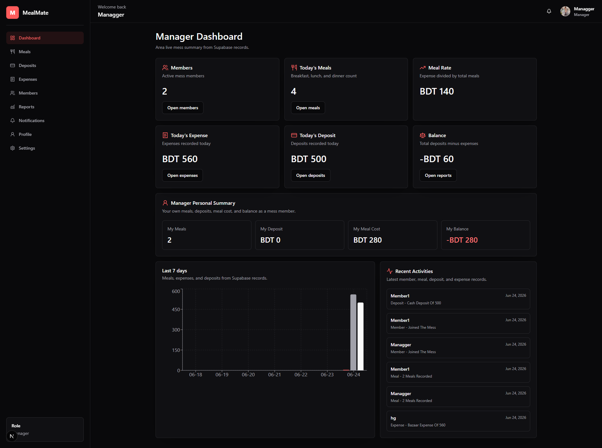
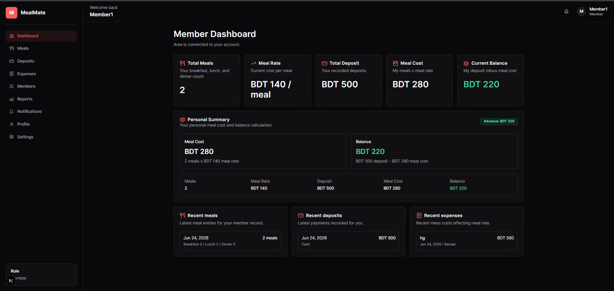

# MealMate

<p align="center">
  <strong>A production-ready mess management platform for meals, deposits, expenses, members, notifications, and monthly reports.</strong>
</p>

<p align="center">
  <a href="https://mealmate51.netlify.app/">Live Demo</a>
  |
  <a href="#screenshots">Screenshots</a>
  |
  <a href="#features">Features</a>
  |
  <a href="#run-locally">Run Locally</a>
</p>

<p align="center">
  
  
  
  
</p>

## Live Demo

MealMate is deployed here:

**https://mealmate51.netlify.app/**

## Why MealMate

Most shared mess systems still run on notebooks, chat messages, and fragile spreadsheets. MealMate turns that daily chaos into a clean role-based workspace where managers can run operations and members can see their own meals, deposits, costs, and balances without asking for manual updates.

It is built as a full-stack Next.js app with Supabase Auth, PostgreSQL, row-level security, protected routes, role-aware navigation, and real application workflows.

## Screenshots

### Manager Dashboard



### Member Dashboard



## Features

- Role-based authentication for managers and members.
- Manager dashboard for mess-wide totals, activity, meals, deposits, expenses, and reports.
- Member dashboard for personal meals, deposits, meal cost, balance, and recent records.
- Meal tracking for breakfast, lunch, and dinner.
- Deposit management with payment method and notes.
- Expense tracking with categories such as bazaar, gas, electricity, internet, rent, utilities, and other.
- Member management with profile details and mess assignment.
- Monthly reports with meal rate, total meals, total expenses, and member balances.
- Notifications for important mess activity.
- Profile and settings pages for account management.
- Supabase row-level security policies to protect role boundaries.
- PWA metadata and responsive app shell.

## Tech Stack

| Layer | Technology |
| --- | --- |
| Framework | Next.js 15 App Router |
| UI | React 19, Tailwind CSS, Radix UI patterns |
| Language | TypeScript |
| Backend | Supabase Auth, PostgreSQL, RLS |
| Forms | React Hook Form, Zod |
| Charts | Recharts |
| Motion | Framer Motion |
| Deployment | Netlify |

## Database Model

MealMate uses a relational Supabase schema with:

- `users` for app profiles and roles.
- `messes` for manager-owned mess spaces.
- `members` for user-to-mess membership.
- `meal_entries` for daily breakfast, lunch, and dinner records.
- `deposits` for member payments.
- `expenses` for mess spending.
- `notifications` for user alerts.
- `monthly_reports` for accounting summaries.

The schema also includes constraints, indexes, helper functions, triggers, and RLS policies. Run [`supabase/schema.sql`](./supabase/schema.sql) in the Supabase SQL editor before launching the app.

## Run Locally

Clone the project and install dependencies:

```bash
npm install
```

Create a Supabase project, open the SQL editor, and run:

```sql
-- paste and execute the contents of supabase/schema.sql
```

Create `.env.local` in the project root:

```bash
NEXT_PUBLIC_SUPABASE_URL=your_supabase_project_url
NEXT_PUBLIC_SUPABASE_ANON_KEY=your_supabase_anon_key
```

Start the development server:

```bash
npm run dev
```

Open `http://localhost:3000`.

## Scripts

```bash
npm run dev        # start local development
npm run build      # create production build
npm run start      # run production server
npm run lint       # run ESLint
npm run typecheck  # run TypeScript checks
```

## Project Structure

```text
app/                 Next.js routes and layouts
components/          Shared UI and layout components
features/auth/       Login, registration, profile, and auth actions
features/mess/       Mess workflows and management components
services/auth/       Session and role helpers
services/mess/       Data access and dashboard queries
supabase/            Client setup, middleware, and database schema
types/               Shared TypeScript database types
```

## Highlights

- Clean separation between auth, mess workflows, services, and UI.
- Server actions for secure mutations.
- Role-aware redirects and protected layouts.
- Database-backed calculations instead of hardcoded dashboard numbers.
- Designed for real shared-living mess operations, not just a demo CRUD app.

## Deployment

The live build is hosted on Netlify:

**https://mealmate51.netlify.app/**

For deployment, add the same Supabase environment variables to the Netlify project settings:

- `NEXT_PUBLIC_SUPABASE_URL`
- `NEXT_PUBLIC_SUPABASE_ANON_KEY`

## License

This project is licensed under the terms in [`LICENSE`](./LICENSE).
